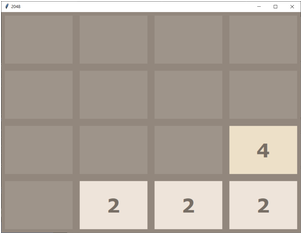
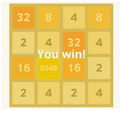
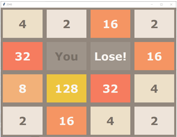

# 2048 Game in Python 🎮

This project is a command-line implementation of the popular **2048 game**, written entirely in Python.  
It focuses on understanding and implementing the **core game logic** without using any GUI libraries.

---

## 📌 About the Game

2048 is a single-player sliding tile puzzle game where the goal is to combine numbers until a tile with the value **2048** is created.
This version represents the game board as a **4×4 matrix** and processes user moves through keyboard input.

---

## 🎯 How to Play

1. The game starts with a **4×4 grid**.
2. Two random cells are initially filled with the number **2**.
3. You can move the tiles using the following keys:

| Key | Action |
|----|-------|
| W / w | Move Up |
| S / s | Move Down |
| A / a | Move Left |
| D / d | Move Right |

4. When two identical numbers collide, they **merge into one tile** with double the value.
5. After every valid move, a new **2** is added to a random empty cell.
6. You **win** if any tile reaches **2048**.
7. The game **ends** when no moves are possible and the grid is full.

---

## 🧠 Game Logic Overview

The entire game logic is implemented using Python lists and functions.

### Key Concepts Used:
- Matrix manipulation
- Grid compression
- Tile merging
- Transpose & reverse operations
- Win/Loss state detection
- Random number placement

---

## 🔧 Important Functions

- `start_game()` – Initializes the game grid
- `add_new_2()` – Adds a new tile to the grid
- `compress()` – Shifts tiles to one direction
- `merge()` – Combines identical tiles
- `move_left()`, `move_right()`, `move_up()`, `move_down()` – Handles player movement
- `get_current_state()` – Checks WIN / LOST / CONTINUE

---

## 🖼️ Screenshot

---

## 🧩 Requirements
- Python 3.x
- No external libraries required.

---

## 📚 Learning Outcomes
- Understanding matrix-based game logic.
- Applying Python functions effectively.
- Implementing real-world game rules.
- Strengthening problem-solving skills.
